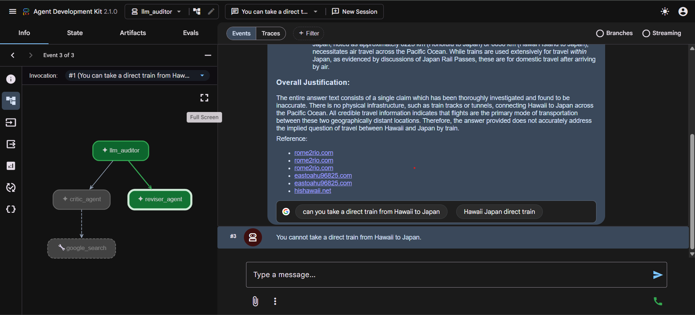
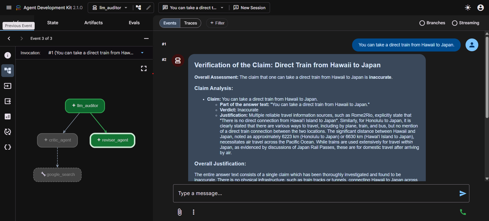
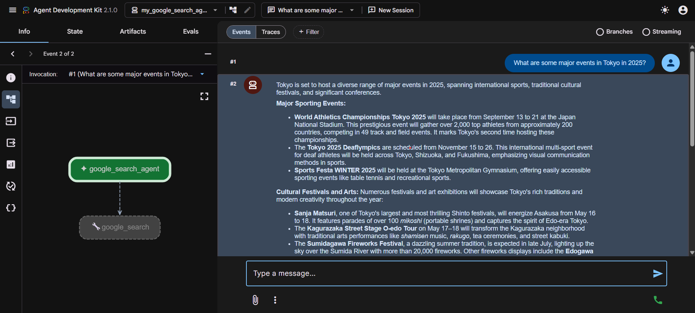
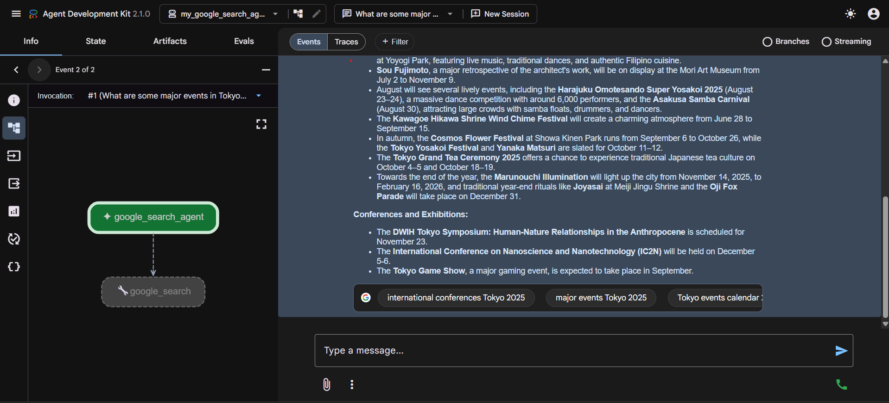
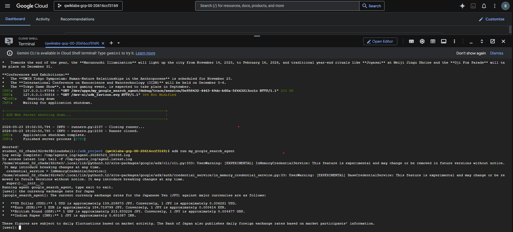
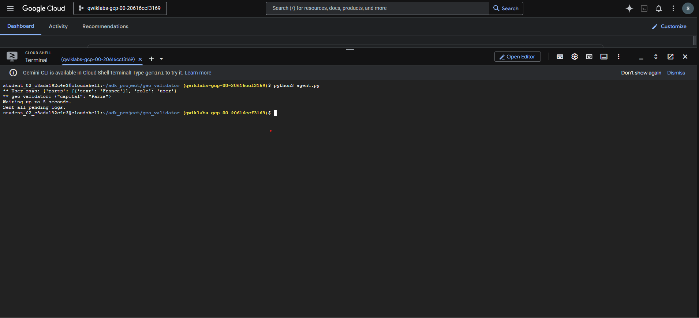

# 🔍 TruthLens AI - Multi-Agent Fact Verification System

An Agent Development Kit (ADK) powered multi-agent system that automatically verifies factual claims, performs web-based evidence gathering, audits LLM responses, and generates corrected outputs with supporting references.

Built using Google Agent Development Kit (ADK), Google Search integration, and a multi-agent architecture for claim validation and hallucination detection.

---

## 🚀 Overview

TruthLens AI helps identify and correct misinformation generated by Large Language Models (LLMs).

The system uses multiple specialized agents:

1. **LLM Auditor Agent**
   - Reviews user claims or LLM responses.
   - Detects potentially incorrect information.

2. **Critic Agent**
   - Breaks down claims into verifiable facts.
   - Requests supporting evidence.

3. **Google Search Agent**
   - Retrieves real-world information from the web.
   - Collects supporting references.

4. **Reviser Agent**
   - Generates corrected responses.
   - Produces evidence-backed conclusions.

---

## 🏗 Architecture

```text
                    ┌─────────────────┐
                    │  User Query     │
                    └────────┬────────┘
                             │
                             ▼
                  ┌────────────────────┐
                  │   LLM Auditor      │
                  └──────┬─────┬───────┘
                         │     │
                         ▼     ▼
                 ┌──────────┐ ┌──────────┐
                 │ Critic   │ │ Reviser  │
                 │ Agent    │ │ Agent    │
                 └────┬─────┘ └────┬─────┘
                      │            │
                      ▼            │
              ┌────────────────┐   │
              │ Google Search  │───┘
              │ Agent          │
              └────────────────┘
```

---

## ✨ Features

- Multi-Agent Fact Verification
- Hallucination Detection
- Google Search Evidence Collection
- Automatic Claim Analysis
- Citation-Based Corrections
- Agent-to-Agent Collaboration
- ADK Event Tracing
- Debug Visualization
- Evidence-Based Final Responses

---

## 📂 Project Structure

```text
TruthLens-AI/
│
├── app_agent/
│   ├── __init__.py
│   ├── agent.py
│   └── prompt.py
│
├── llm_auditor/
│   ├── __init__.py
│   ├── agent.py
│   └── prompt.py
│
├── my_google_search_agent/
│   ├── __init__.py
│   ├── agent.py
│   └── tools.py
│
├── geo_validator/
│   ├── __init__.py
│   ├── agent.py
│   └── prompt.py
│
├── screenshots/
│   ├── architecture.png
│   ├── fact_verification.png
│   ├── adk_trace.png
│   ├── search_agent.png
│   ├── cloud_shell.png
│   └── workflow.png
│
├── callback_logging.py
├── requirements.txt
├── README.md
├── LICENSE
└── .gitignore
```

```

---

## 🛠 Tech Stack

### Frameworks
- Google Agent Development Kit (ADK)

### LLM
- Gemini Models

### Tools
- Google Search Tool
- ADK Event Tracing

### Language
- Python 3.12+

### Cloud
- Google Cloud Platform
- Cloud Shell

---

## ⚙️ Installation

### Clone Repository

```bash
git clone https://github.com/yourusername/truthlens-ai.git
cd truthlens-ai
```

### Create Virtual Environment

```bash
python -m venv .venv
source .venv/bin/activate
```

### Install Dependencies

```bash
pip install -r requirements.txt
```

### Configure API Keys

```bash
export GOOGLE_API_KEY="YOUR_API_KEY"
```

---

## 🧪 Example 1

### Input

```text
You can take a direct train from Hawaii to Japan.
```

### Result

```text
Claim Status: Inaccurate

Reason:
There is no physical train connection between Hawaii and Japan.
Travel between these locations requires air transportation.

Corrected Response:
You cannot take a direct train from Hawaii to Japan.
```

---

## 🧪 Example 2

### Input

```text
What are some major events in Tokyo in 2025?
```

### Output

```text
World Athletics Championships Tokyo 2025
Tokyo Deaflympics 2025
Tokyo Game Show
Traditional Japanese Festivals
International Conferences
```

---

## 📸 Screenshots

### Multi-Agent Workflow



---

### Fact Verification Example



---

### Agent Execution



---

### Detailed Evidence Collection



---

### Cloud Shell Execution



---

### Search Agent Output



---

## 🔄 Workflow

1. User submits a claim.
2. LLM Auditor reviews response.
3. Critic Agent extracts factual assertions.
4. Google Search Agent gathers evidence.
5. Reviser Agent creates corrected answer.
6. Final verified response is returned.

---

## 🎯 Use Cases

### Fact Checking

Verify AI-generated responses before publishing.

### Research Assistant

Validate research findings with external sources.

### Hallucination Detection

Detect fabricated information produced by LLMs.

### Educational Applications

Provide evidence-backed learning assistance.

### Enterprise Knowledge Systems

Improve reliability of AI-generated reports.

---

## 📈 Future Enhancements

- RAG Integration
- Vector Database Support
- Multi-Source Verification
- Confidence Scoring
- PDF Report Generation
- Real-Time Monitoring Dashboard
- Citation Ranking System
- Human-in-the-Loop Validation

---

## 👨‍💻 Author

### Mayur Dharwadkar

Computer Science Engineering Student

GitHub:
https://github.com/Mayur-N-D

LinkedIn:
https://www.linkedin.com/in/mayur-dharwadkar-937125397/

---

## ⭐ Acknowledgements

- Google Agent Development Kit (ADK)
- Google Gemini
- Google Cloud Platform
- Python Open Source Community

---

## 📜 License

MIT License
